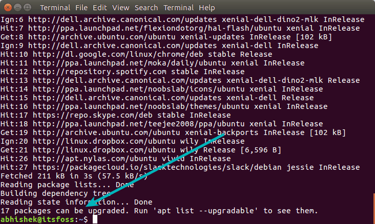

# Difference Between apt and apt-get Explained

URL: [Difference Between apt and apt-get Explained](https://itsfoss.com/apt-vs-apt-get-difference/)

Brief: This article explains the **difference between apt and apt-get** commands of Linux. It also lists some of the most commonly used `apt` commands that replace the older `apt-get` commands.

**One of the noticeable new features of Ubuntu 16.04** was the ‘introduction’ of `apt` command. The reality is that the first stable version of `apt` was released in the year 2014 but people started noticing it in 2016 with the release of Ubuntu 16.04.

It became common to see `apt install package` instead of the usual `apt-get install package`. Eventually, many other distributions followed Ubuntu’s footsteps and started to encourage users to use `apt` instead of `apt-get`.

You might be wondering what’s the difference between `apt-get` and `apt`? And if they have a similar command structure, what was the need for the new `apt` command? You might also be thinking if `apt` is better than `apt-get`? Should you be using the new `apt` command or stick with the good old `apt-get` commands?

I’ll explain all these questions in this article and I hope that by the end of this article, you’ll have a clearer picture.

## apt vs apt-get

Before we see the difference between apt and apt-get, let’s go into the backdrop(背景) of these commands and what exactly they try to achieve.

### Why apt was introduced in the first place?

**Debian**, mother Linux of distributions like **Ubuntu**, **Linux Mint**, **elementary OS** etc, has a robust packaging system and every component and application is built into a package that is installed on your system. Debian uses a set of tools called **Advanced Packaging Tool** (**APT**) to manage this packaging system. Don’t confuse it with the command `apt`, it’s not the same.

> 注意：两个概念的区别  
> Advanced Packaging Tool（APT）是一套工具  
> apt是一个command

There are various tools that interact with **APT** and allow you to install, remove and manage packages in Debian based Linux distributions. `apt-get` is one such command-line tool which is widely popular. Another popular tool is **Aptitude** with both GUI and command-line options.

Those tools are way too low level and they have so many functionalities which are perhaps never used by an average Linux user. On the other hand, the most commonly used package management commands are scattered across `apt-get` and `apt-cache`.

The `apt` commands have been introduced to solve this problem. `apt` consists some of the most widely used features from `apt-get` and `apt-cache` leaving aside obscure and seldom used features. It can also manage `apt.conf` file.

With `apt`, you don’t have to fiddle your way from `apt-get` commands to `apt-cache`. `apt` is more structured and provides you with necessary options needed to manage packages.

> `apt`=most common used command options from `apt-get` and `apt-cache`.

## Difference between apt and apt-get

So with `apt`, you get all the necessary tools in one place. You won’t be lost under tons of command options. The main aim of `apt` is to **provide an efficient way of handling package in a way “pleasant for end users”**.

When Debian says “pleasant for end users”, it actually means that. It has fewer but sufficient command options but in a more organized way. On top of that, it enables a few options by default that is actually helpful for the end users.

For example, you get to see the progress bar while installing or removing a program in `apt`.

`apt` also prompts you with the number of packages that can be upgraded when you update the repository database.

You can achieve the same with `apt-get` as well if you use additional command options. apt enables them by default and takes the pain away.

## Difference between `apt` and `apt-get` commands

While `apt` does have some similar command options as `apt-get`, it’s not backward compatible with `apt-get`. That means it won’t always work if you just replace the `apt-get` part of an `apt-get` command with `apt`.

Let’s see which `apt` command replaces which `apt-get` and `apt-cache` command options.

| apt command      | the command it replaces | function of the command                              |
| ---------------- | ----------------------- | ---------------------------------------------------- |
| apt install      | apt-get install         | Installs a package                                   |
| apt remove       | apt-get remove          | Removes a package                                    |
| apt purge        | apt-get purge           | Removes package with configuration                   |
| apt update       | apt-get update          | Refreshes repository index                           |
| apt upgrade      | apt-get upgrade         | Upgrades all upgradable packages                     |
| apt autoremove   | apt-get autoremove      | Removes unwanted packages                            |
| apt full-upgrade | apt-get dist-upgrade    | Upgrades packages with auto-handling of dependencies |
| apt search       | apt-cache search        | Searches for the program                             |
| apt show         | apt-cache show          | Shows package details                                |

`apt` has a few commands of its own as well.

| new apt command  | function of the command                                  |
| ---------------- | -------------------------------------------------------- |
| apt list         | Lists packages with criteria (installed, upgradable etc) |
| apt edit-sources | Edits sources list                                       |

One point to note here is that `apt` is under continuous development. So you may see a few new options added to the command in the future versions.

## Is `apt-get` deprecated?

I didn’t find any information that says that `apt-get` will be discontinued. And it actually shouldn’t be. It still has a lot more functionalities to offer than `apt`.

For low-level operations, in scripting etc, `apt-get` will still be used.

## Should I use `apt` or `apt-get`?

You might be thinking if you should use `apt` or `apt-get`. And as a regular Linux user, my answer is to go with `apt`.

`apt` is the command that is being recommended by the Linux distributions. It provides the necessary option to manage the packages. Most important of all, it is easier to use with its fewer but easy to remember options.

I see no reason to stick with `apt-get` unless you are going to do specific operations that utilize more features of `apt-get`.

## Conclusion

I hope I was able to explain the difference between `apt` and `apt-get`. In the end, to summarize the `apt` vs `apt-get` debate:

- `apt` is a subset of `apt-get` and `apt-cache` commands providing necessary commands for package management
- while `apt-get` won’t be deprecated, as a regular user, you should start using `apt` more often

