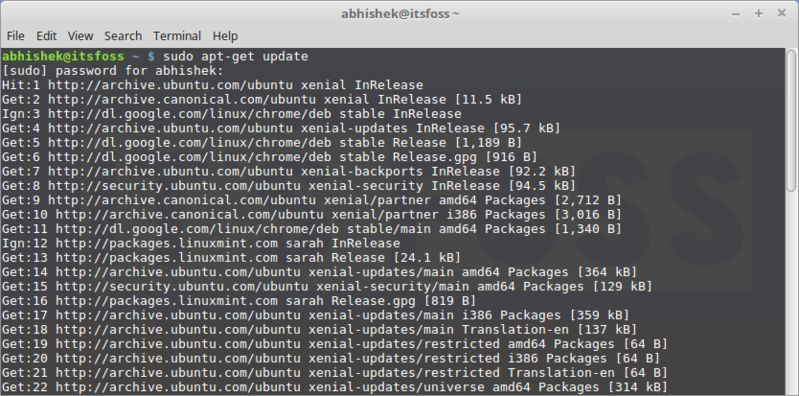
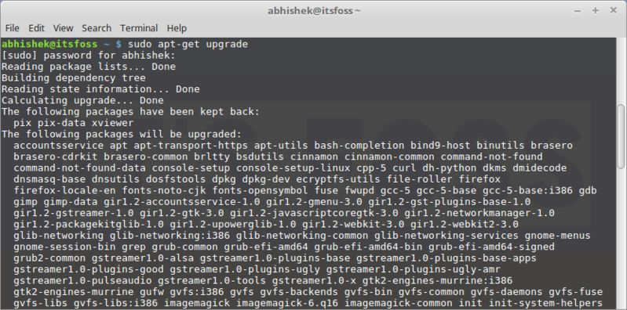
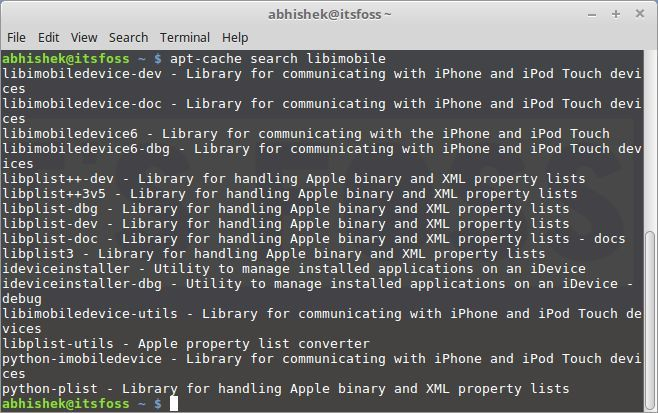
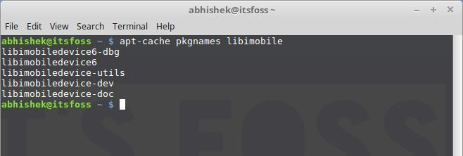
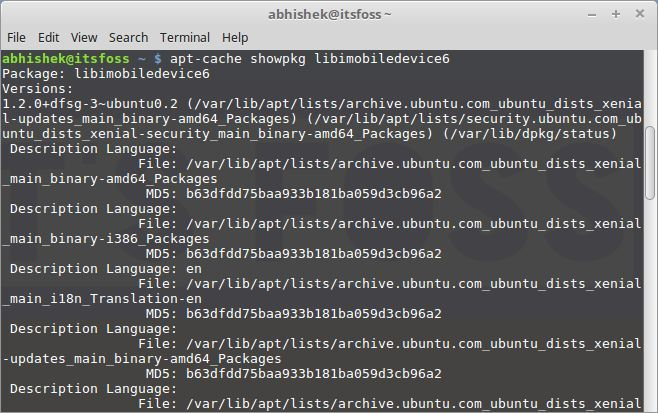
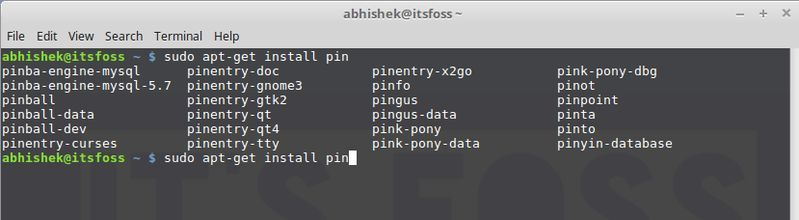
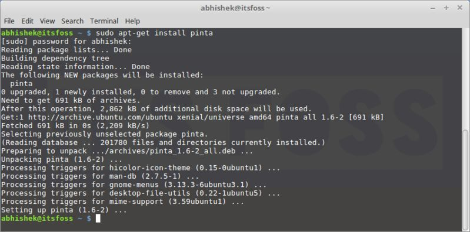
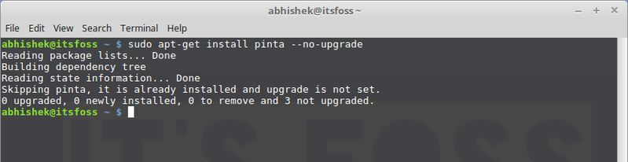
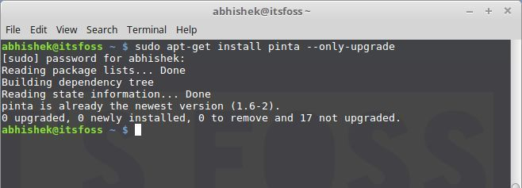

# Using apt-get Commands In Linux

URL: [Using apt-get Commands In Linux](https://itsfoss.com/apt-get-linux-guide/)

**Brief**: This beginner’s guide shows you what you can do with `apt-get` commands in Linux, how to use it to find new packages, install and upgrade new packages and clean your system.

<!-- TOC depthFrom:2 -->

- [Using apt-get Commands In Linux](#using-apt-get-commands-in-linux)
  - [1. What is `apt-get`](#1-what-is-apt-get)
  - [2. Update & Upgrade](#2-update--upgrade)
    - [2.1. Update package database with apt-get](#21-update-package-database-with-apt-get)
    - [2.2. Upgrade installed packages with apt-get](#22-upgrade-installed-packages-with-apt-get)
    - [2.3. Difference between upgrade and dist-upgrade](#23-difference-between-upgrade-and-dist-upgrade)
    - [2.4. What is the difference between apt-get update and apt-get upgrade?](#24-what-is-the-difference-between-apt-get-update-and-apt-get-upgrade)
  - [3. Search](#3-search)
    - [3.1. Using `apt-cache` commands to search for packages](#31-using-apt-cache-commands-to-search-for-packages)
  - [4. Install](#4-install)
    - [4.1. How to install new packages with apt-get](#41-how-to-install-new-packages-with-apt-get)
    - [4.2. How to install multiple packages](#42-how-to-install-multiple-packages)
    - [4.3. What if you run `install` on an already installed package](#43-what-if-you-run-install-on-an-already-installed-package)
    - [4.4. How to install packages without upgrading](#44-how-to-install-packages-without-upgrading)
    - [4.5. How to only upgrade packages, not install it](#45-how-to-only-upgrade-packages-not-install-it)
    - [4.6. How to install a specific version of an application](#46-how-to-install-a-specific-version-of-an-application)
  - [5. Remove](#5-remove)
    - [5.1. How to remove installed packages with apt-get](#51-how-to-remove-installed-packages-with-apt-get)
    - [5.2. What is the difference between `apt-get remove` and `apt-get purge`?](#52-what-is-the-difference-between-apt-get-remove-and-apt-get-purge)
  - [6. Clean](#6-clean)
    - [6.1. How to clean your system with apt-get](#61-how-to-clean-your-system-with-apt-get)

<!-- /TOC -->

## 1. What is `apt-get`

**Ubuntu** is derived from **Debian** Linux. And **Debian** uses **dpkg** packaging system. A packaging system is a way to provide programs and applications for installation. This way, you don’t have to build a program from the source code.

**APT** (**Advanced Package Tool**) is the command line tool to interact with this packaging system. There is already `dpkg` commands to manage it. But `apt` is more friendly way to handle packaging. You can use it to find and install new packages, upgrade packages, clean the packages etc.

There are **two main tool** around it: `apt-get` and `apt-cache`. `apt-get` is for installing, upgrading and cleaning packages while `apt-cache` is used for finding new packages. We’ll see all these commands with examples later in this guide.


## 2. Update & Upgrade

### 2.1. Update package database with apt-get

`apt-get` basically works on a database of available packages. If you don’t update this database, the system won’t know if there are newer packages available or not. In fact, this is the first command you need to run in any Linux system after a fresh install.

Updating the package database requires super user privileges so you’ll need to use sudo.

```bash
sudo apt-get update
```

When you run this command, you’ll see the information being retrieved from various servers.



You’ll see **three** types of lines, **hit**, **get** and **ign**. Let me explain that to you:

- **hit**: there is no change in package version
- **ign**: the package is being ignored. There could be various reasons for that. Either the package is way too recent that it doesn’t even bother to check or there was an error in retrieving the file but error was trivial and thus it is being **ignored**. This is not an error. There is no need to be worried.
- **get**: There is a new version available. It will download the information (not the package itself).

### 2.2. Upgrade installed packages with apt-get

Once you have updated the package database, you can upgrade the installed packages. The most convenient way is to upgrade all the packages that have updates available. You can use the command below for this purpose:

```bash
sudo apt-get upgrade
```



To upgrade only a specific program, use the command below:

```bash
sudo apt-get upgrade <package_name>
```

There is another way to provide a complete upgrade by using the command below:

```bash
sudo apt-get dist-upgrade
```

This actually looks for the dependencies with the newer version and tries to install it. **But you should avoid using it**. I’ll explain it in the next section.

### 2.3. Difference between upgrade and dist-upgrade

The command `apt-get upgrade` is very obedient. It never tries to remove any packages or tries to install a new package on its own.

The command `apt-get dist-upgrade`, on the other hand, is proactive. It looks for dependencies with the newer version of the package being installed and it tries to install a new package or remove an existing one on its own.

It sounds like `dist-upgrade` is more powerful and intelligent, isn’t it? But there is a risk with it.

See, it has a ‘smart’ conflict resolution system. With that in place, it will attempt to upgrade the most important packages on the expense of the less important ones. This may lead to the removal of some packages which you might not want. **This is the main reason why `dist-upgrade` should be avoided on production machines**.

### 2.4. What is the difference between apt-get update and apt-get upgrade?

This is a very common confusion. You are not the only one to be confused by the term `update` and `upgrade`.

Though it sounds like when you do an `apt-get update`, it will update the packages. But that’s not true. `apt-get update` only updates the database of the packages. For example, if you have XYX package version 1.3 installed, after `apt-get update`, the database will be aware that a newer version 1.4 is available.

When you do an `apt-get upgrade` after `apt-get update`, it upgrades (or updates, whichever term you prefer) the installed packages to the newer version.

This is the reason why the fastest and the most convenient way to update **Ubuntu** is to use this command:

```bash
sudo apt-get update && sudo apt-get upgrade -y
```

## 3. Search

### 3.1. Using `apt-cache` commands to search for packages

This comes pretty handy when you are looking for some specific lib. All you need to do is to use the following command. You don’t even need `sudo` here.

```bash
apt-cache search <search term>
```



You don’t need to know the exact name of the package. It searches in **package name** and **their short description** and shows result based on that.

If you just want to search the packages with **specific package names**, you can use the command below:

```bash
apt-cache pkgnames <search_term>
```

This gives you the list of all the packages starting with your search term.



Once you know **the exact package name**, you can get more information about it such as version, dependencies etc by using the command below:

```bash
apt-cache showpkg <package_name>
```



## 4. Install

### 4.1. How to install new packages with apt-get

If you know the name of the package, you can easily install it using the command below:

```bash
sudo apt-get install <package_name>
```

Just replace the `<package_name>` with your desired package. Suppose I want to install Pinta image editor, all I need to do is to use the command below:

```bash
sudo apt-get install pinta
```

The good thing about this command is that it has **auto-completion**. So if you are not sure about the exact package name, you can type a few letters and press tab and it will suggest all the packages available with those letters. For example:



### 4.2. How to install multiple packages

You are not restricted to install just one package at a time. You can install several packages at a time by providing their names:

```bash
sudo apt-get install <package_1> <package_2> <package_3>
```




### 4.3. What if you run `install` on an already installed package

Suppose you have already a package installed but you used the install command for the already installed package. This will actually look into the database and if a newer version is found, **it will upgrade the installed package to the newer one**. So no harm done by using this command unless you don’t want it to be upgraded.

### 4.4. How to install packages without upgrading

Suppose for some reason you want to install a package but don’t want to upgrade it if it is already installed. Sounds weird, but you may have your reasons to do that.

For that case, you can use the sub `--no-upgrade` in the following manner:

```bash
sudo apt-get install <package_name> --no-upgrade
```



### 4.5. How to only upgrade packages, not install it

In case you only want to upgrade a package but don’t want to install it (if it’s not already installed), you can do that with the following command:

```bash
sudo apt-get install <package_name> --only-upgrade
```



### 4.6. How to install a specific version of an application

By default, the latest version available in the repository will be installed for any application. But for some reasons, if you don’t want to install the latest version, you can specify the version number (you would need to know the exact version number that you want to install).

All you need to do is to add `=version` with the name of the package.

```bash
sudo apt-get install <package_name>=<version_number>
```

## 5. Remove

### 5.1. How to remove installed packages with apt-get

It’s not that you can only install packages with `apt-get`. You can also remove packages with it. All you need to do is to use the command in this manner:

```bash
sudo apt-get remove <package_name>
```

**Auto-completion** works here as well. So you just start typing package name and press `tab` and it will suggest all the installed packages starting with those letters.

Another way of uninstalling packages is to use `purge`. The command is used in the following manner:

```bash
sudo apt-get purge <package_name>
```

### 5.2. What is the difference between `apt-get remove` and `apt-get purge`?

- `apt-get` remove just removes the binaries of a package. It doesn’t touch the configuration files
- `apt-get purge` removes everything related to a package including the configuration files

So if you have ‘remove’ a particular software and install it again, your system will have the same configuration files. Of course, you will be asked to override the existing configuration files when you install it again.

Purge is particularly useful when you have messed up with the configuration of a program. You want to completely erase its traces from the system and perhaps start afresh.

Most of the time, simple `remove` is more than enough for uninstalling a package.

## 6. Clean

### 6.1. How to clean your system with apt-get

Oh yes! You can also clean your system with `apt-get` and free up some disk space.

You can use the command below to clean the local repository of retrieved package files:

```bash
sudo apt-get clean
```

Another way is to use `autoclean`. Unlike the above `clean` command, `autoclean` only removes those retrieved package files that have a newer version now and they won’t be used anymore.

```bash
sudo apt-get autoclean
```

Another way to free up disk space is to use `autoremove`. It removes libs and packages that were installed automatically to satisfy the dependencies of an installed package. If the package is removed, these automatically installed packages are useless in the system. This command removes such packages.

```bash
sudo apt-get autoremove
```

This is command-line way of cleaning Linux system. If you prefer GUI, here are some [CCleaner alternatives for Linux](https://itsfoss.com/ccleaner-alternatives-ubuntu-linux/) which you can use on Ubuntu and Ubuntu based Linux distributions.

