# Using apt Commands in Linux

URL: [Using apt Commands in Linux](https://itsfoss.com/apt-command-guide/)

Brief: This article shows you how to use `apt` commands in Linux with examples so that you can manage packages effectively.

First noticed in **Ubuntu 16.04**, `apt` is slowly gaining popularity. As more and more Ubuntu based Linux distributions are pushing for `apt` to be the recommended command for package management, it is time that you learn how to use `apt` commands.

<!-- TOC depthFrom:2 -->

- [Using apt Commands in Linux](#using-apt-commands-in-linux)
  - [1. What is apt](#1-what-is-apt)
  - [2. Update](#2-update)
    - [2.1. Update package database with apt](#21-update-package-database-with-apt)
    - [2.2. Upgrade installed packages with apt](#22-upgrade-installed-packages-with-apt)
    - [2.3. What is the difference between `apt update` and `apt upgrade`?](#23-what-is-the-difference-between-apt-update-and-apt-upgrade)
    - [2.4. How to only upgrade packages, not install it](#24-how-to-only-upgrade-packages-not-install-it)
  - [3. Install](#3-install)
    - [3.1. How to install new packages with apt](#31-how-to-install-new-packages-with-apt)
    - [3.2. How to install multiple packages with apt](#32-how-to-install-multiple-packages-with-apt)
    - [3.3. What if you run `apt install` on an already installed package?](#33-what-if-you-run-apt-install-on-an-already-installed-package)
    - [3.4. How to install packages without upgrading](#34-how-to-install-packages-without-upgrading)
    - [3.5. How to install a specific version of an application](#35-how-to-install-a-specific-version-of-an-application)
  - [4. Remove](#4-remove)
    - [4.1. How to remove installed packages with apt](#41-how-to-remove-installed-packages-with-apt)
    - [4.2. What is the difference between `apt remove` and `apt purge`?](#42-what-is-the-difference-between-apt-remove-and-apt-purge)
  - [5. Search](#5-search)
    - [5.1. Search for packages](#51-search-for-packages)
    - [5.2. See the content of a package](#52-see-the-content-of-a-package)
    - [5.3. List upgradable and installed versions](#53-list-upgradable-and-installed-versions)
  - [6. Clean](#6-clean)
    - [6.1. How to clean your system with apt](#61-how-to-clean-your-system-with-apt)

<!-- /TOC -->

## 1. What is apt

You might already know that **Ubuntu** is derived from **Debian** Linux. And **Debian** uses **dpkg packaging system**. **A packaging system** is a way to provide programs and applications for installation. This way, you don’t have to build a program from the source code which, trust me, is not a pretty way to handle packages.

**APT** (**Advanced Package Tool**) is the command line tool to interact with the **packaging system**. There is already `dpkg` commands to manage it. But **APT** is a more friendly way to handle packaging. You can use it to find and install new packages, upgrade packages, remove the packages etc.

`apt` commands provide command line way to interact with **APT** and manage packages.

At this point, I must mention `apt-get` is perhaps the most popular tool around **APT**. But `apt` is slowly promoted as its alternative.

## 2. Update

### 2.1. Update package database with apt

`apt` actually works on **a database of available packages**. If the database is not updated, the system won’t know if there are any newer packages available. This is why updating the repository should be the first thing to do in in any Linux system after a fresh install.

Updating the package database requires superuser privileges so you’ll need to use `sudo`.

```bash
sudo apt update
```

When you run this command, you’ll see the package information being retrieved from various servers.

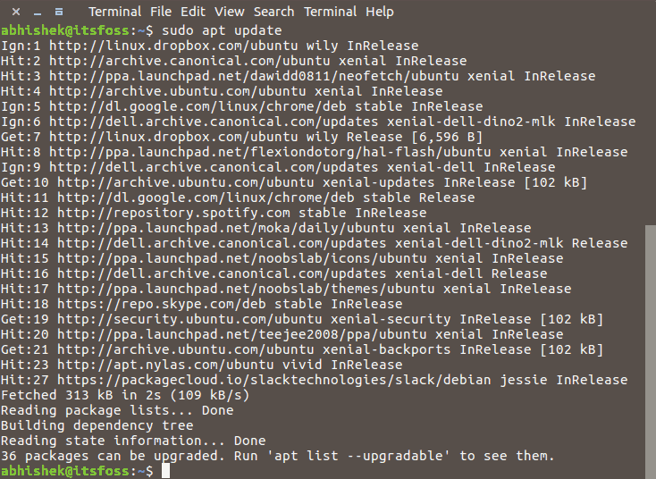

### 2.2. Upgrade installed packages with apt

Once you have updated the package database, you can now `upgrade` the installed packages. The most convenient way is to upgrade all the packages that have available updates. You can simply use the command below:

```bash
sudo apt upgrade
```

This will show you how many and which all packages are going to be upgraded.

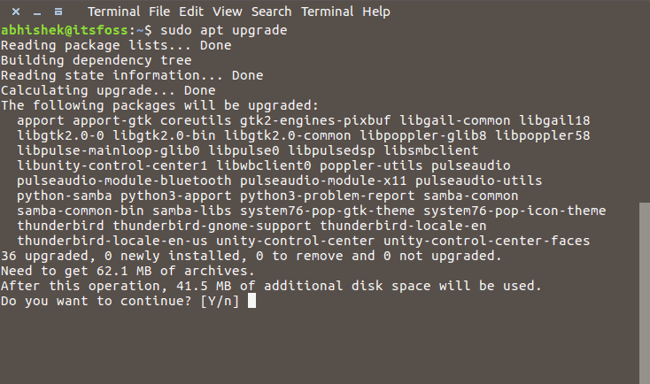

There is another way to provide a complete upgrade by using the command below:

```bash
sudo apt full-upgrade
```

`full-upgrade` works the same as `upgrade` except that if system upgrade needs the removal of a package already installed on the system, it will do that. Whereas, the normal `upgrade` command won’t do this.

### 2.3. What is the difference between `apt update` and `apt upgrade`?

Though it sounds like when you do an `apt update`, it will update the packages and you’ll get the latest version of the package. But that’s not true. `apt update` only updates the database of the packages.

For example, if you have XYZ package version 1.3 installed, after `apt update`, the database will be aware that a newer version 1.4 is available.  When you do an `apt upgrade` after `apt update`, it upgrades (or updates, whichever term you prefer) the installed packages to the newer version.

This is the reason why the fastest and the most convenient way to update Ubuntu system by using this command:

```bash
sudo apt update && sudo apt upgrade -y
```

Now let me explain the above command.

Actually, it’s not a single command. It’s a combination of two commands. The `&&` is a way to combine two commands in a way that the second command runs only when the previous command ran successfully.

The ‘`-y`’ in the end **automatically** enters `yes` when the command ‘`apt upgrade`’ ask for your confirmation before installing the updates.

Note that you can also use the two commands separately, one by one:

```bash
sudo apt update
sudo apt upgrade
```

It will take a little longer because you have to wait for one command to finish and then enter the second command.

### 2.4. How to only upgrade packages, not install it

If you only want to upgrade a package but don’t want to install it (if it’s not already installed), you can do that with the following command:

```bash
sudo apt install <package_name> --only-upgrade
```

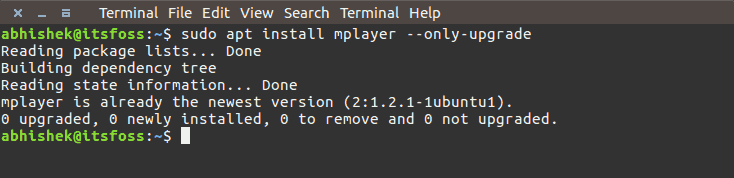

## 3. Install

### 3.1. How to install new packages with apt

If you already know the name of the package, you can install it using the command below:

```bash
sudo apt install <package_name>
```

Just replace the `<package_name>` with the desired package. Suppose you want to install **mplayer**, you can simply use the command below:

```bash
sudo apt install mplayer
```

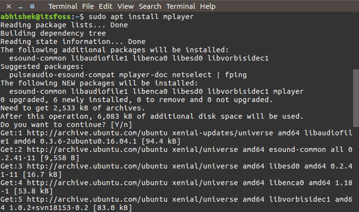

The good thing here is that you can use **auto-completion**. So, if you are not sure about the exact package name, you can type a few letters and press tab and it will suggest all the packages available with those letters. For example:

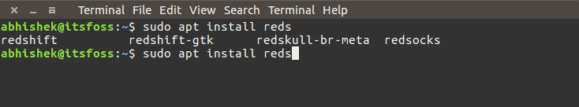

### 3.2. How to install multiple packages with apt

You are not bound to install just one package at a time. You can install several packages at a time by providing the package names all together:

```bash
sudo apt install <package_1> <package_2> <package_3>
```

### 3.3. What if you run `apt install` on an already installed package?

No need to worry. This will just look into the database and if a newer version is found, **it will upgrade the installed package to the newer one**. So no harm is done by using it, unless you don’t want it to be upgraded.

### 3.4. How to install packages without upgrading

If for some reason you want to install a package, but don’t want to upgrade, it if it is already installed. In that case, you can use the option `--no-upgrade` in the following manner:

```bash
sudo apt install <package_name> --no-upgrade
```

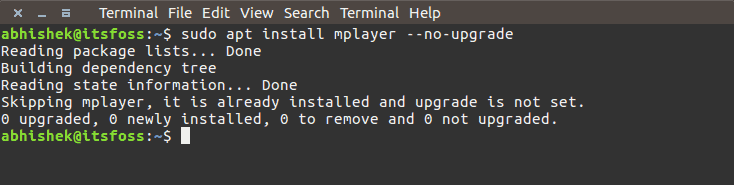


### 3.5. How to install a specific version of an application

By default, the latest version available in the repository will be installed for an application. But if you don’t want to install the latest version, you can specify the version number. You would need to know the exact version number that you want to install.

Just add `=version` with the name of the package.

```bash
sudo apt install <package_name>=<version_number>
```

## 4. Remove

### 4.1. How to remove installed packages with apt

Enough talk about installing packages, let’s see how to remove packages. Removing packages is as easy as installing them. Just use the command below:

```bash
sudo apt remove <package_name>
```

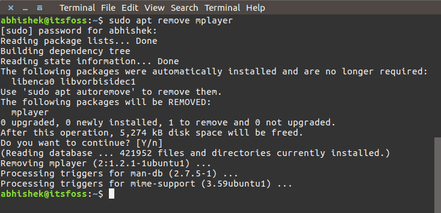

**Auto-completion** works here as well. So you just start typing package name and press `tab` and it will suggest all the installed packages starting with those letters.

Another way of uninstalling packages is to use `purge`. The command is used in the following manner:

```bash
sudo apt purge <package_name>
```

### 4.2. What is the difference between `apt remove` and `apt purge`?

- `apt remove` just removes the binaries of a package. It leaves residue configuration files.
- `apt purge` removes everything related to a package including the configuration files.

If you used `apt remove` to a get rid of a particular software and then install it again, your software will have the same configuration files. Of course, you will be asked to override the existing configuration files when you install it again.

Purge is useful when you have messed up with the configuration of a program. You want to completely erase its traces from the system and perhaps start afresh. And yes, you can use `apt purge` on an already removed package.

Usually, `apt remove` is more than enough for uninstalling a package.

## 5. Search

### 5.1. Search for packages

Just use the following command with desired search terms. It will find all the packages containing your search term.

```bash
apt search <search term>
```
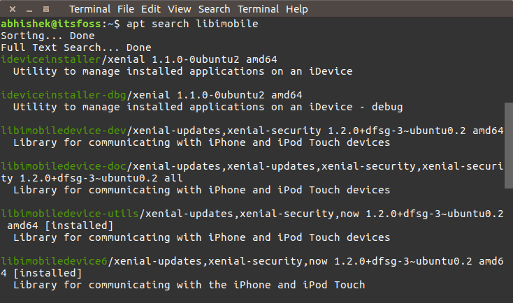

### 5.2. See the content of a package

If you want to know more about a package before installing or removing it, you can use the below command:

```bash
apt show <package_name>
```

This will show information about the given package(s) like its dependencies, installation and download size, different sources the package is available from, the description of the content of the package among other things:

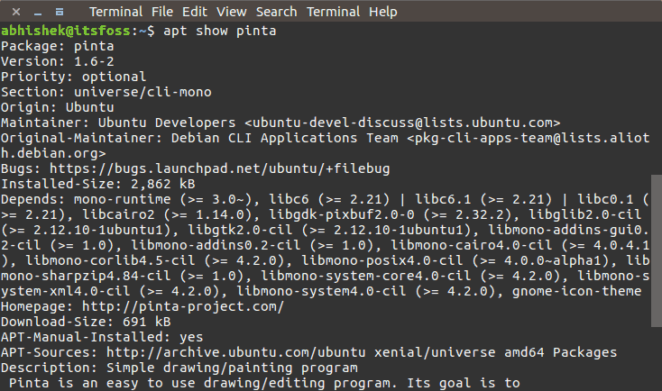

### 5.3. List upgradable and installed versions

`apt` command has a new option called `list`. Using this command, you can see all the packages that have a newer version ready to be upgraded:

```bash
apt list --upgradeable
```

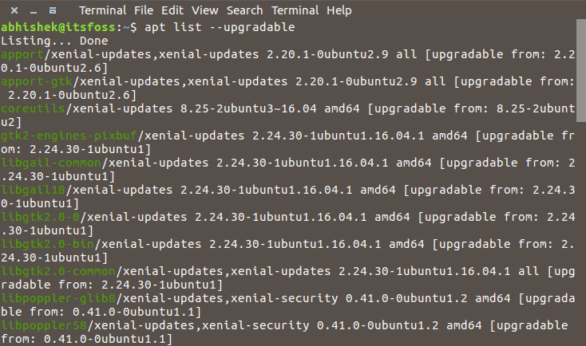

You can also see all the installed packages on the system with installed option:

```bash
apt list --installed
```

There is also a third option called `--all-versions`. It will list all the packages available for your system:

```bash
apt list --all-versions
```

## 6. Clean

### 6.1. How to clean your system with apt

Unlike `apt-get`, you don’t have `clean` and `autoclean` commands here. You can still use the `autoremove` option and free up some diskspace:

```bash
sudo apt autoremove
```

This command removes libs and packages that were installed automatically to satisfy the dependencies of an installed package. If the package is removed, these automatically installed packages, though useless, remains in the system.

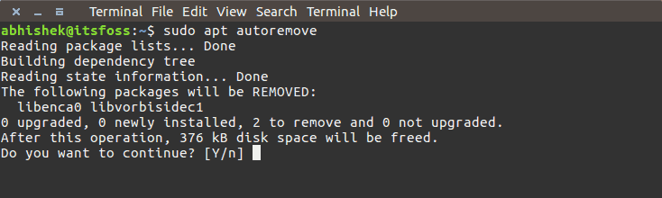

I had recently cleaned my system and that is why it shows only a few Kb of files to be removed. Otherwise, you could easily get 100s of Mb of free space with this command.

