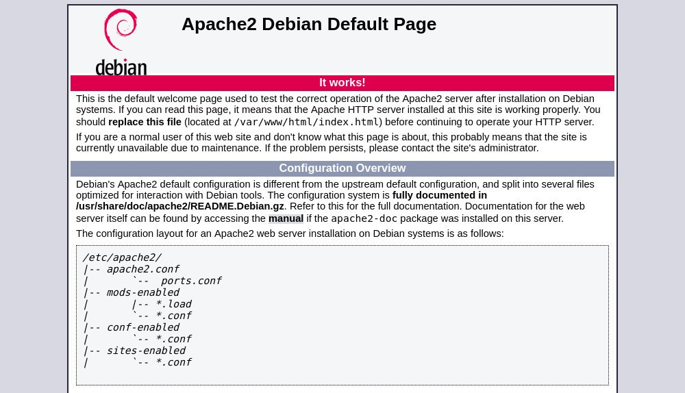

# How to Install Apache on Debian 9

<!-- TOC -->

- [1. Installing Apache](#1-installing-apache)
- [2. Adjust the Firewall](#2-adjust-the-firewall)
- [3. Verifying Apache Installation](#3-verifying-apache-installation)
- [4. Manage the Apache service with systemctl](#4-manage-the-apache-service-with-systemctl)
- [6. Reference](#6-reference)

<!-- /TOC -->

## 1. Installing Apache

Apache is available in the default Debian repositories and the installation is pretty straightforward.

First update the package index and afterwards install the `apache2` package with the following commands:

```bash
sudo apt update
sudo apt install apache2
```

That’s it, Apache is installed and automatically started, you can check the status of the Apache service with:

```bash
sudo systemctl status apache2
```

```txt
$ sudo systemctl status apache2
● apache2.service - The Apache HTTP Server
   Loaded: loaded (/lib/systemd/system/apache2.service; enabled; vendor preset: enabled)
   Active: active (running) since Wed 2019-10-23 17:42:35 CST; 3min 49s ago
 Main PID: 14553 (apache2)
   CGroup: /system.slice/apache2.service
           ├─14553 /usr/sbin/apache2 -k start
           ├─14555 /usr/sbin/apache2 -k start
           └─14556 /usr/sbin/apache2 -k start
```

## 2. Adjust the Firewall

If you use `iptables` to filter connections to your system, you’ll need to open HTTP (`80`) and HTTPS (`443`) ports.
Open the necessary ports by issuing the following command:

```bash
sudo iptables -A INPUT -p tcp --dport 80 -j ACCEPT
sudo iptables -A INPUT -p tcp --dport 443 -j ACCEPT
```

## 3. Verifying Apache Installation

To verify that everything works correctly, open your browser, type your server IP address or domain name `http://YOUR_IP_OR_DOMAIN/` and you will see the default Apache welcome page as shown below:



## 4. Manage the Apache service with systemctl

Now that Apache installed on your Debian system, you can take a minute to look over and become familiar with the basic apache service management commands:

To stop the Apache service, run:

```bash
sudo systemctl stop apache2
```

Start it again, by typing:

```bash
sudo systemctl start apache2
```

To restart the Apache service:

```bash
sudo systemctl restart apache2
```

Reload the Apache with a new configuration with:

```bash
sudo systemctl reload apache2
```

If you want to disable the Apache service to start at boot:

```bash
sudo systemctl disable apache2
```

And to re-enable it again:

```bash
sudo systemctl enable apache2
```


## 6. Reference

- [How to Install Apache on Debian 9](https://linuxize.com/post/how-to-install-apache-on-debian-9/)
- [How To Set Up Apache Virtual Hosts on Debian 9](https://linuxize.com/post/how-to-set-up-apache-virtual-hosts-on-debian-9/)
- [What And How To Use Apache Virtual Host?](https://dasunhegoda.com/what-how-to-apache-virtual-host/444/)
