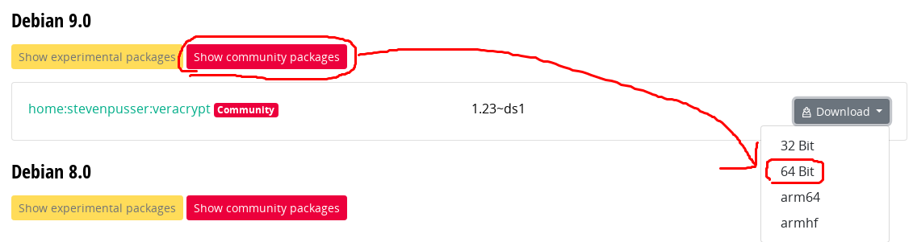

# How To Use VeraCrypt On Linux

URL: [How To Use VeraCrypt On Linux](https://www.addictivetips.com/ubuntu-linux-tips/use-veracrypt-on-linux/)

For years, `TrueCrypt` was the encryption tool of choice for Linux users. It worked well, and it did everything you could ever want. Then one day, the project was discontinued. Ever since then, Linux users have been scrambling to find an encryption tool that works as well. For most, the best tool to use is `VeraCrypt`.

> 一代加密工具`TrueCrypt`逝去，让人追思。然而，替代者为`VeraCrypt`。

The main reason that VeraCrypt stands out from the rest of the new encryption tools is that it is a “fork” from the old `TrueCrypt` code. This means if you’ve used `TrueCrypt` for years but want something that is actively maintained, you can install `VeraCrypt` on Linux and everything will continue to work.

> `VeraCrypt`是`TrueCrypt`的一个分支，也是一个继承者。

The `VeraCrypt` software is impressive. With it, users can encrypt individual files, create volumes, and encrypt entire partitions. Here’s how to use `VeraCryp` on Linux.

## Installation

Debian

There are no official repositories Debian users can add to their system to install the VeraCrypt encryption software. That said, the easiest way to install it is to [download the DEB file directly from the OpenSUSE build service page](https://software.opensuse.org/package/veracrypt). It currently has support for Debian 7 – 9.

> 还有其他Linux操作系统（例如：Ubuntu、Fedora、OpenSUSE），而由于我的操作系统是Debian 9，因此只列了Debian 9的安装方式。



下载之后的文件名为：`veracrypt_1.23_ds1-0.1_obs_amd64.deb`

将文件进行安装

```bash
sudo dpkg -i veracrypt_1.23_ds1-0.1_obs_amd64.deb
```

安装完成后，会在Applications中看到`VeraCrypt`的图标。打开软件之后，就和`TrueCrypt`操作是类似的。
